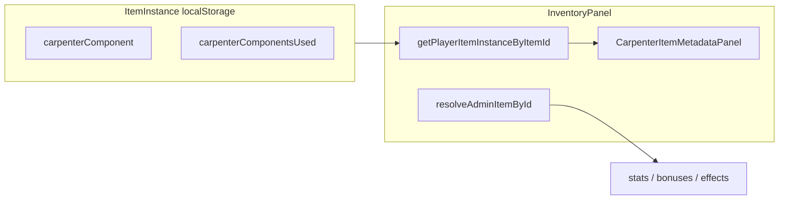
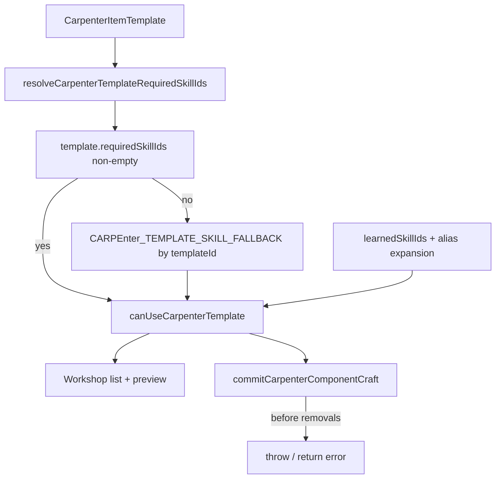

# ТЗ 5.1 + 5.3 — Carpenter UI (инвентарь + skill-gating мастерской)

Две независимые frontend-фазы. Рекомендуемый порядок: **5.1 → 5.3** (инвентарь не зависит от skill-gating).

---

# Фаза A — ТЗ 5.1: Carpenter metadata в инвентаре

## Контекст

Данные уже сохраняются в `ItemInstance`:

- [`apps/frontend/src/services/content/models.ts`](apps/frontend/src/services/content/models.ts) — `CarpenterCraftedComponentSnapshot`, `BlacksmithUsedCarpenterComponentSnapshot`
- [`apps/frontend/src/services/playerItemInstances.ts`](apps/frontend/src/services/playerItemInstances.ts) — normalize/upsert `carpenterComponent`, `carpenterComponentsUsed`

**Проблема интеграции:** [`resolveEffectiveAdminItem`](apps/frontend/src/services/playerItemInstances.ts) мержит только боевые/визуальные поля и **не** прокидывает carpenter metadata в `AdminItem`. UI читает instance напрямую через `getPlayerItemInstanceByItemId(itemId)`.



## Точки встраивания

[`apps/frontend/src/components/InventoryPanel.tsx`](apps/frontend/src/components/InventoryPanel.tsx)

| Место | Функция | Что добавить |
|-------|---------|--------------|
| Детали справа | `renderSelectedItemDetails()` (~2493) | Блок metadata после lore/stats |
| Полный popup | `renderItemPopup()` (~2018) | Тот же блок после «Материалы ковки» |
| Список рюкзака | `renderInventoryCards()` (~2698) | Badge под именем |

**Не трогаем:** craft pipelines, `resolveEffectiveAdminItem`, backend, combat, `equipmentEffects`.

## Новые файлы (5.1)

1. [`apps/frontend/src/features/inventory/carpenterItemMetadataDisplay.ts`](apps/frontend/src/features/inventory/carpenterItemMetadataDisplay.ts) — pure helpers: `formatCarpenterComponentKind`, `formatSourceTreeLabel`, `formatQualityBand`, `formatWoodTraitTag`, `hasCarpenterMetadata`, `getInventoryCardCarpenterBadge`
2. [`apps/frontend/src/features/inventory/CarpenterItemMetadataPanel.tsx`](apps/frontend/src/features/inventory/CarpenterItemMetadataPanel.tsx) — блоки component / used[], warning при `sourceLost`, collapsible debug JSON
3. CSS в [`apps/frontend/src/styles.css`](apps/frontend/src/styles.css): `.character-item-carpenter-metadata`, `.carpenter-metadata-chip`, `.character-item-carpenter-badge` (по образцу `.character-item-craft-materials`)

---

# Фаза B — ТЗ 5.3: Skill-gating шаблонов мастерской плотника

## Контекст и находки в коде

**Мастерская сейчас:** [`PlayerProfessionsPanel.tsx`](apps/frontend/src/components/PlayerProfessionsPanel.tsx) ~1384–1553 — вкладка `workshop` для `carpenter`. Фильтры: поиск, `recipeGroup`, `componentKind`. Все 74 шаблона видны и craftable; **нет** проверки навыков.

**Изученные навыки игрока:**

```txt
selectedProfession.state.learnedSkillIds
```

Хранилище: `theend.playerProfessions.{characterId}` через [`loadPlayerProfessionsState`](apps/frontend/src/services/playerProfessions.ts). Godmode: `profession skill learn carpenter <skillId>` в [`App.tsx`](apps/frontend/src/App.tsx).

**Каталог навыков:** `professionSkills` из content API + seed в [`professionSkillRepository.ts`](apps/frontend/src/services/professionSkillRepository.ts).

**Критично для реализации:**

- Все **74** `carpenterItemTemplates` в snapshot имеют **пустой** `requiredSkillIds` → fallback mapping **обязателен**
- Реальные ID навыков в проекте — префикс `carpentry_skill_*`, не `carp_*` из ТЗ
- В content/seed сейчас **17** carpenter skills; **нет** `carp_shield_core_basics` и `carp_staff_core_basics` (есть только в spec [`theend_carpenter_wood_system_spec_skills.md`](theend_carpenter_wood_system_spec_skills.md))

### Соответствие TZ spec → project IDs (минимум 5 gates)

| TZ canonical key | Project skill ID | RU name |
|------------------|------------------|---------|
| `carp_simple_handle` | `carpentry_skill_basic_handle` | Простая рукоять |
| `carp_apprentice_shaft` | `carpentry_skill_apprentice_shaft` | Древко ученика |
| `carp_board_marking` | `carpentry_skill_plank_marking` | Разметка доски |
| `carp_shield_core_basics` | *(нет в content)* | Щитовая основа |
| `carp_staff_core_basics` | *(нет в content)* | Основа посоха |

Для gates 4–5: mapping реализуется по TZ, шаблоны показывают lock reason; ручная проверка — через godmode `profession skill learn` **после** добавления 2 skill-записей в content seed (см. ниже). Не подставлять чужие навыки в alias (иначе ложный unlock).



## 1. Helper skill-gating

**Новый файл:** [`apps/frontend/src/professions/carpenter/carpenterTemplateAccess.ts`](apps/frontend/src/professions/carpenter/carpenterTemplateAccess.ts)

```ts
export interface CarpenterTemplateAccessResult {
  isUnlocked: boolean;
  missingSkillIds: string[];
  missingSkillNames: string[];
  requiredSkillIds: string[];
  reason?: string;
}

export function resolveCarpenterTemplateRequiredSkillIds(template: CarpenterItemTemplate): string[];

export function canUseCarpenterTemplate(params: {
  template: CarpenterItemTemplate;
  learnedSkillIds: string[];
  skillNameById?: Record<string, string>;
}): CarpenterTemplateAccessResult;
```

**Логика `resolveCarpenterTemplateRequiredSkillIds`:**

1. Если `template.requiredSkillIds?.length > 0` → вернуть как есть
2. Иначе lookup в `CARPENTER_TEMPLATE_SKILL_FALLBACK: Record<string, string[]>` по `template.id` (полный mapping из ТЗ §5)
3. Если нет записи → `[]` (базовые / незагейтенные шаблоны)

**Базовые без навыка (пустой required):**

`template_carpenter_clean_log`, `plank_basic`, `beam_basic`, `split_log`, `charcoal_basic`, `wood_glue_basic`, `treated_bark`

**Alias map** (`CARPENTER_SKILL_ALIASES: Record<string, string[]>`):

- Ключ = canonical gate ID из ТЗ (`carp_simple_handle`, …)
- Значение = все принимаемые learned IDs: TZ id + project id + legacy variants
- Пример: `carp_simple_handle → ['carp_simple_handle', 'carpentry_skill_basic_handle', 'carpenter_simple_handle', 'simple_handle']`
- Навык считается изученным, если `learnedSkillIds` пересекается с **любым** alias **любого** required gate

**`canUseCarpenterTemplate`:**

- `requiredSkillIds` = resolve (canonical keys)
- Для каждого required: satisfied если ∃ alias ∈ learned
- `missingSkillNames` из `skillNameById` (fallback: canonical id)
- `reason`: `Требуется навык: ${names.join(', ')}`

## 2. UI мастерской

Файл: [`PlayerProfessionsPanel.tsx`](apps/frontend/src/components/PlayerProfessionsPanel.tsx)

### 2.1 Данные

```ts
const carpenterLearnedSkillIds = selectedProfession.state.learnedSkillIds ?? [];
const carpenterSkillNameById = useMemo(() => 
  Object.fromEntries(professionSkills
    .filter(s => s.professionId === 'carpenter')
    .map(s => [s.id, s.name])), [professionSkills]);
```

Для каждого template вычислять `canUseCarpenterTemplate({ template, learnedSkillIds, skillNameById })`.

### 2.2 Фильтр доступности

Новый state `carpenterAccessFilter: 'all' | 'unlocked' | 'locked'` (default `'all'`).

Расширить `visibleCarpenterTemplates` — после search/group/kind фильтровать по access.

### 2.3 Список шаблонов (~1413)

| Состояние | Отображение |
|-----------|-------------|
| Unlocked | `template.name` + id + kind (как сейчас) |
| Locked | затемнённый стиль (`opacity`, серый border), `🔒 {name}`, hint `Требуется навык: {name}` |

Locked template **можно выбрать** (показать requirements), но input slots / craft disabled.

### 2.4 Детали / preview (~1436)

Если locked:

- Блок: «Шаблон заблокирован. Требуется навык: …»
- Кнопка «Создать компонент» → `disabled`
- Material selects → `disabled` (опционально, чтобы не вводить в заблуждение)

### 2.5 CSS

Минимальные inline или классы: `.carpenter-template-locked`, `.carpenter-template-lock-reason` в существующем стиле profession panel.

## 3. Runtime commit protection

Файл: [`apps/frontend/src/professions/carpenter/carpenterComponentCrafting.ts`](apps/frontend/src/professions/carpenter/carpenterComponentCrafting.ts)

### 3.1 Расширить params

`buildCarpenterComponentPreview` и `commitCarpenterComponentCraft` принимают:

```ts
learnedSkillIds?: string[];
skillNameById?: Record<string, string>;
```

### 3.2 Проверка **до** списания материалов

В `buildCarpenterComponentPreview` (после `validateSelections`, до return):

```ts
const access = canUseCarpenterTemplate({ template, learnedSkillIds, skillNameById });
if (!access.isUnlocked) {
  validation.errors.push(
    `Шаблон заблокирован. Требуется навык: ${access.missingSkillNames.join(', ')}`
  );
}
```

В `commitCarpenterComponentCraft` — дублирующая проверка **перед** `buildCarpenterInputRemovals` (~637):

```ts
if (!access.isUnlocked) {
  return { ok: false, errors: [`Template locked. Missing skills: ...`], warnings: [] };
}
```

Гарантия: при ошибке **не** списываются доска/смола, **не** создаётся item.

### 3.3 Wiring в PlayerProfessionsPanel

Передать `learnedSkillIds` и `skillNameById` в preview `useMemo` (~764) и в `commitCarpenterComponentCraft` onClick (~1514).

## 4. Content gap: shield/staff skills (для ручной проверки gates 4–5)

**Не менять backend code.** Допустимо добавить 2 записи в [`professionSkillRepository.ts`](apps/frontend/src/services/professionSkillRepository.ts) seed (frontend fallback catalog):

- `carpentry_skill_shield_core_basics` (alias: `carp_shield_core_basics`) — «Щитовая основа»
- `carpentry_skill_staff_core_basics` (alias: `carp_staff_core_basics`) — «Основа посоха`

И включить их в `CARPENTER_SKILL_ALIASES` для соответствующих canonical keys. Это позволит godmode learn и ручные кейсы 4–5 без backend deploy.

*Альтернатива:* оставить только mapping + lock UI; gates 4–5 проверять после добавления skills в admin content — менее удобно для acceptance.

## 5. Проверка

```bash
npm run typecheck
```

### ТЗ 5.3 — ручные кейсы

| # | Сценарий | Ожидание |
|---|----------|----------|
| 1 | Есть `carpentry_skill_basic_handle` | «Рукоять меча» unlocked, craft OK |
| 2 | Нет handle skill | Locked + reason + disabled button |
| 3 | Вызов commit с locked template | Материалы не списаны, ошибка skill |
| 4 | Базовые рецепты (clean log, plank, beam, glue) | Всегда unlocked |
| 5 | Фильтры Все / Доступные / Заблокированные + поиск | Работают, группы не сломаны |

Godmode для кейса 1:

```txt
profession skill learn carpenter carpentry_skill_basic_handle
```

## 6. Отчёт после выполнения (5.3)

1. Хранилище learned skills: `PlayerProfessionsState.learnedSkillIds` / localStorage `theend.playerProfessions.*`
2. Helper: `carpenterTemplateAccess.ts`
3. Fallback: template.id → canonical gate keys; content `requiredSkillIds` приоритетнее
4. Locked UI: dim + 🔒 + reason в list и preview
5. Runtime: `canUseCarpenterTemplate` в preview + commit до removals
6. Проверенные 5 gates (с оговоркой по shield/staff если skills ещё не в content)
7. Подтверждение: backend/combat/blacksmith/inventory persistence не менялись
8. Результат `npm run typecheck`

---

# Файлы (итог обеих фаз)

| Действие | Файл |
|----------|------|
| Create | `apps/frontend/src/features/inventory/carpenterItemMetadataDisplay.ts` |
| Create | `apps/frontend/src/features/inventory/CarpenterItemMetadataPanel.tsx` |
| Create | `apps/frontend/src/professions/carpenter/carpenterTemplateAccess.ts` |
| Edit | `apps/frontend/src/components/InventoryPanel.tsx` |
| Edit | `apps/frontend/src/components/PlayerProfessionsPanel.tsx` |
| Edit | `apps/frontend/src/professions/carpenter/carpenterComponentCrafting.ts` |
| Edit | `apps/frontend/src/styles.css` |
| Optional | `apps/frontend/src/services/professionSkillRepository.ts` (2 shield/staff skills для acceptance) |
| Optional | `scripts/tz5-blacksmith-ui-smoke.mjs` |

**Не меняем:** backend src, combat, `equipmentEffects`, blacksmith forge logic, `playerItemInstances` schema, item persistence, mini-game.
